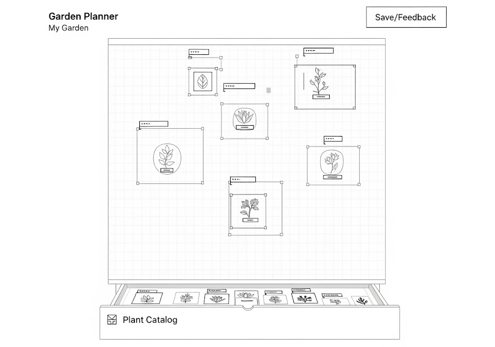
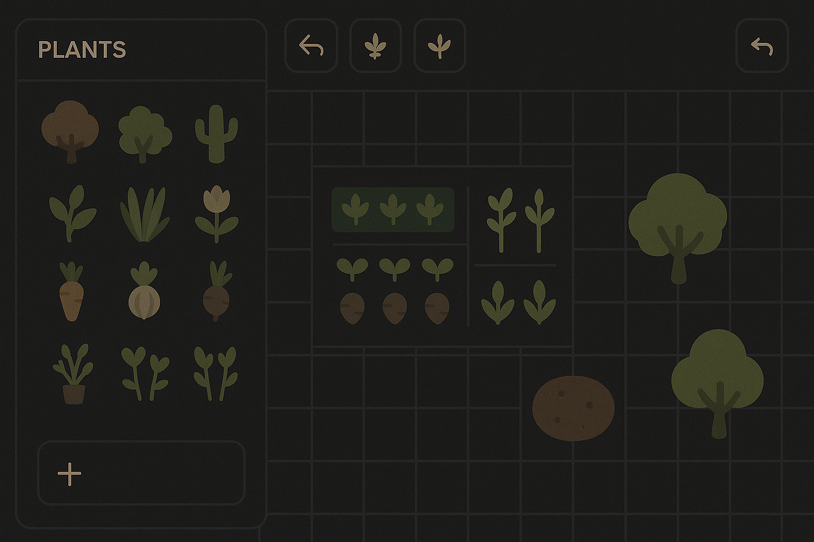

# Resumen del MVP

Fecha: 16/10/2025
Proyecto: Mi Huerto Digital

## Objetivo del MVP

Construir una aplicación PWA que permita a usuarios aficionados diseñar visualmente un huerto, añadir plantas desde un catálogo y consultar fichas básicas de cuidado. El MVP será 100% funcional offline y tendrá persistencia local.

## Alcance

Incluye:
- Lienzo visual editable (añadir/mover/editar elementos).

- Catálogo de plantas descargable y cacheable.
- Ficha de información de cada planta.
- Guardado persistente en IndexedDB.
- Interfaz responsive para móvil y tablet.
- Pipeline CI básico con tests.

Excluye (post-MVP):
- Sincronización en la nube y cuentas de usuario.
- Alertas inteligentes y funciones sociales.

## Métricas de éxito

- Tiempo medio para crear y guardar un diseño (meta: < 5 min para usuario nuevo).
- Tasa de éxito e2e (meta: 95% en CI para flujo crítico).
- Tiempo de carga inicial (meta: < 3s en conexiones medianas).

## Recursos y horizonte

- Duración estimada: 3 meses (5 sprints de 2 semanas + 1 semana de cierre).
- Equipo mínimo: 1 PO, 2 devs frontend, 1 backend, 1 QA, 1 UX.

## Riesgos principales

- Pérdida/corrupción de datos locales (mitigación: versionado de IndexedDB).
- Problemas de rendimiento en canvas (mitigación: profilings y límites MVP).
- Dependencia de la carga inicial del catálogo (mitigación: catálogo embarcado como fallback).

## Roadmap corto

- Sprint 0: Setup infra, linters, CI.
- Sprint 1: Lienzo editable + persistencia.
- Sprint 2: Catálogo y visualización.
- Sprint 3: Drag & drop y fichas.
- Sprint 4: QA y performance.

## Requisitos no funcionales

- Offline-first.
- Seguridad: HTTPS en producción.
- Accesibilidad básica (WCAG AA target mínimo para componentes críticos).

## Entregables del MVP

- App PWA desplegable localmente.
- Repositorio con CI configurado.
- Documentación técnica inicial (arquitectura y riesgos).

## Notas finales

Se recomienda una revisión al finalizar Sprint 1 para ajustar alcance y actualizar estimaciones tras pruebas de rendimiento.
